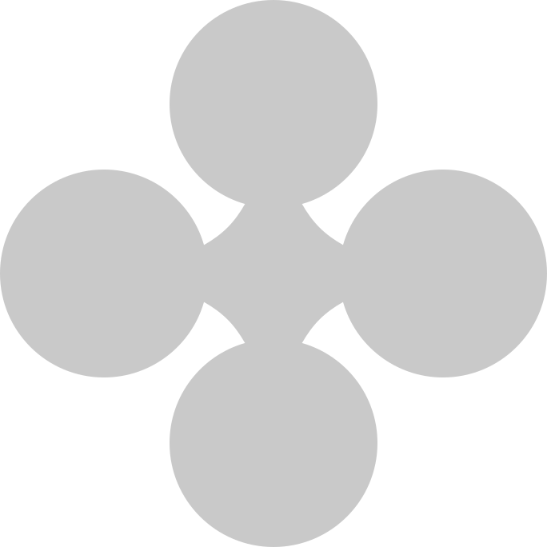

# 🫧 Bubbles - A Modern Note-Taking Experience



> 🚧 **Work in Progress**: Currently in active development with authentication features implemented.

## 🌟 Overview

Bubbles is reimagining the note-taking experience with an innovative design language and smart features. Going beyond traditional note-taking apps, Bubbles aims to create an engaging and interactive way to capture, organize, and revisit your thoughts.

## ✨ Features

### Current Features
- 🔐 **Authentication System**
  - Google OAuth Integration
  - Microsoft OAuth Integration
  - Facebook OAuth Integration
  - Secure sign-in management via Clerk

## 🛠️ Tech Stack

- **Frontend**: Next.js 14
- **Authentication**: Clerk
- **3D Graphics**: Three.js / React Three Fiber
- **Animations**: React Spring
- **Styling**: CSS Modules

## 🚀 Getting Started

1. **Clone the repository**
```bash
git clone https://github.com/yourusername/bubbles.git
cd bubbles
```

2. **Install dependencies**
```bash
npm install
# or
yarn install
```

3. **Set up environment variables**
```bash
cp .env.example .env.local
```
Fill in your Clerk credentials and other required environment variables.

4. **Run the development server**
```bash
npm run dev
# or
yarn dev
```

5. Open [http://localhost:3000](http://localhost:3000) in your browser

## 🎨 Design Philosophy

Bubbles combines fluid animations, interactive 3D elements, and a minimalist interface to create a unique note-taking experience. The design language emphasizes:

- Fluid Interactions
- Visual Feedback
- Intuitive Navigation
- Seamless Transitions

## 🤝 Contributing

While this project is still in early development, we welcome feedback and suggestions! Feel free to:

1. 🐛 Report bugs
2. 💡 Suggest features
3. 📝 Submit pull requests

## 📝 License

This project is licensed under the MIT License - see the [LICENSE](LICENSE) file for details.

## 👨‍💻 Author

- [@dieselsharma](https://twitter.com/dieselsharma) - Designer & Developer

## 🔗 Links

- [Live Demo](https://bubbles-note.vercel.app)
- [GitHub Repository](https://github.com/ojasharma/Bubbles)
- [Follow Development Progress](https://twitter.com/dieselsharma)

---

<p align="center">Made with ❤️ by @ojasharma</p>
